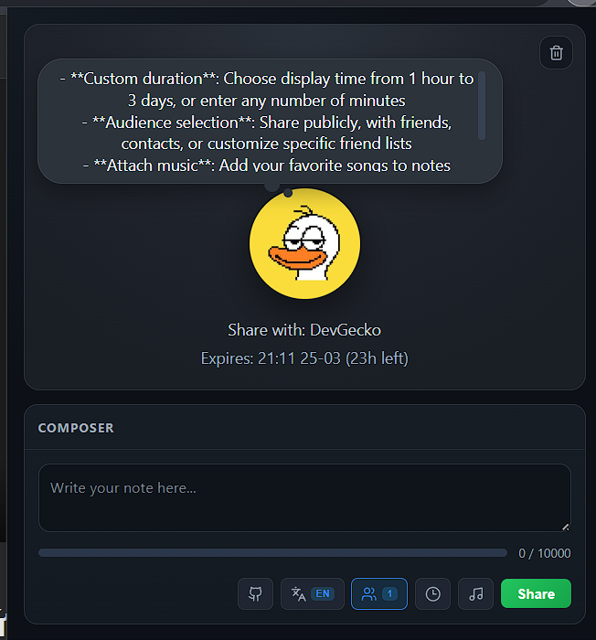

# FB Notes Extended

[English Version](./README.en.md)

Extension Chrome cho phép viết ghi chú Facebook dài không giới hạn và thiết lập thời hạn tùy chỉnh theo phút.

## Tính năng

- **Vượt giới hạn 60 ký tự**: Viết ghi chú dài tới 10.000 ký tự thay vì giới hạn 60 ký tự mặc định của Facebook
- **Thời hạn tùy chỉnh**: Chọn thời gian hiển thị ghi chú từ 1 giờ đến 3 ngày, hoặc nhập số phút tùy ý
- **Chọn đối tượng**: Chia sẻ công khai, bạn bè, danh bạ, hoặc tuỳ chỉnh danh sách bạn bè cụ thể
- **Đính kèm nhạc**: Thêm bài hát yêu thích vào ghi chú
- **Giao diện tối**: Thiết kế tối giản, dễ nhìn
- **Đa ngôn ngữ**: Hỗ trợ Tiếng Việt và English



## Cài đặt

### Cách 1: Tải extension đã build sẵn (Khuyên dùng)

1. Tải file `FB-Notes-Extended.zip` từ [Releases](https://github.com/DuckCIT/FB-Notes-Extended/releases)
2. Giải nén file zip vào một thư mục bất kỳ
3. Mở Chrome, truy cập `chrome://extensions/`
4. Bật **Chế độ dành cho nhà phát triển** (Developer mode) ở góc trên bên phải
5. Nhấn **Tải tiện ích đã giải nén** (Load unpacked)
6. Chọn thư mục vừa giải nén
7. Extension đã sẵn sàng sử dụng!

### Cách 2: Build từ source

Yêu cầu: Node.js 18+

1. Clone repository về máy
2. Mở terminal tại thư mục project
3. Chạy `npm install` để cài đặt dependencies
4. Chạy `npm run build` để build extension
5. Load thư mục `dist` như extension unpacked trong Chrome

## Hướng dẫn sử dụng

### Tạo ghi chú mới

1. Mở [Facebook](https://facebook.com) và đăng nhập
2. Nhấn vào icon extension trên thanh công cụ Chrome
3. Viết nội dung ghi chú trong ô soạn thảo
4. Chọn các tuỳ chọn:
   - **Đối tượng**: Công khai, Bạn bè, Danh bạ, hoặc Tuỳ chỉnh
   - **Thời hạn**: 1h, 6h, 24h, 3d, hoặc nhập số phút tùy ý
   - **Nhạc**: Tìm kiếm và chọn bài hát để đính kèm
5. Nhấn **Chia sẻ**

### Xoá ghi chú hiện tại

Khi đã có ghi chú đang hiển thị, nút xoá (biểu tượng thùng rác) sẽ xuất hiện ở góc trên bên phải của popup. Nhấn vào để xoá ghi chú hiện tại.

## Lưu ý

- Extension chỉ hoạt động khi bạn đang ở trang facebook.com
- Giới hạn ký tự thực tế là 10.000 (do giới hạn API của Facebook)
- Thời hạn tối đa có thể vượt quá 3 ngày nếu nhập số phút tùy ý

## Cấu trúc project

```
├── dist/                  # Extension đã build (load folder này vào Chrome)
├── public/
│   ├── icons/            # Icons của extension
│   └── manifest.json     # Chrome extension manifest
├── src/
│   ├── background/       # Service worker xử lý API calls
│   ├── content/          # Content script
│   ├── lib/              # Utilities
│   └── popup/            # Popup UI (React)
├── popup.html
├── package.json
├── tsconfig.json
└── vite.config.ts
```

## Development

- `npm install` - Cài đặt dependencies
- `npm run dev` - Development mode với hot reload
- `npm run build` - Production build

## Đóng góp

Mọi đóng góp đều được chào đón! Vui lòng tạo Pull Request hoặc Issue trên GitHub.

## Giấy phép

MIT License

---

**English Version**: [README.en.md](./README.en.md)
